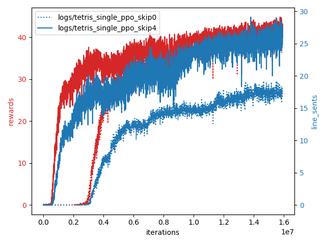

# TetrisBattle-RL

This is about training a RL agent to master once popular game -- Tetris Battle. Codes are forked from [1], which contains lots of famous RL algorithms. 

The challenge of mastering Tetris Battle:  
1. It's hard to eliminate lines via random actions, so rewards are sparse.  
2. The inputs are 600 * 800 images. (very big!)  

Due to above challenges, the training is not successful by directly applying the algorithms in [1]. Therefore, I try to reduce the complexity of the games, and the concrete methods are 
1. Use observations with smaller dimension (the hidden grid of the game).   
2. Reduce choices of the Tetriminos (which is blocks in Tetris).

The score in Tetris Battle is called "line sent", and it is computed as following.  

1. line sents = number of cleared line - 1.
2. line sents = 4 if you clear 4 lines simultaneously (this move called *Tetris*).
3. line sents = 4 if you clear 2 lines with *T-spin*. 
4. The player can get the additional sents by consecutive eliminating lines, and this behavior is called *combo*. The player can get bonus 1 / 2 / 3 / 4 sents by 1 ~ 2 / 3 ~ 4 / 5 ~ 6 / > 7 combos. 
5. If the player use T-spin or Tetrix in this turn, he will get the *back to back* flag. When the next turn he also uses T-spin or Tetrix, he can get 2 bonus sents. The flag will disappear after a normal elimination. 

## Requirements

- Python3 
- [OpenAI-baseline](https://github.com/openai/baseline) 

other requirements:  
`pip install -r requirements.txt`

## Usage

### Two kinds of Tetriminos
In this experiment, there are only I-shaped and O-shaped Tetriminos when playing. Under this setting, we can hugely reduce the complexity of the game and increase the probablity of the agent getting rewards.

To reproduce the results, follow the steps below,

1. Change `POSSIBLE_KEYS = ['I', 'O', 'J', 'L', 'Z', 'S', 'T']` in `TetrisBattle/settings.py` to `POSSIBLE_KEYS = ['I', 'I', 'I', 'I', 'O', 'O', 'O']`.
2. Train the RL agent with PPO algorithm:  
`bash train_two_blocks.sh`.

This model uses raw screenshot as inputs and resized the input to 224 * 224. The reward is defined as the sum of "line sents" and "number of cleared lines". 

## Experiments

### Two kinds of Tetriminos

The above figure is the learning curve of the agent. It shows that the agent can learn with only two kinds of Tetriminos.  

I also compare the results between different numbers of skipping frames. The results show that the agent learns fast with 4 skipping frames, while it learns stable with 0 skipping frames. The outcomes are reasonable due to there are few redundancies with 4 skipping frames, so the training is fast. On the other side, there might be some important frames are skipped, thus, the training becoming unstable.

Watch the performance of the learned agent: https://www.youtube.com/watch?v=vrmX3c4WIl0

## References
[1] https://github.com/ikostrikov/pytorch-a2c-ppo-acktr-gail  
[2] https://github.com/louis2889184/TetrisBattle

